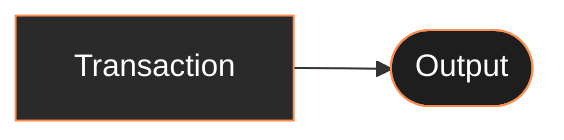
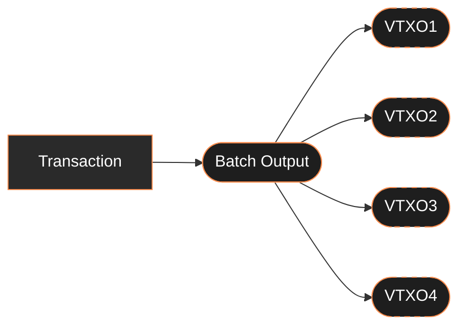
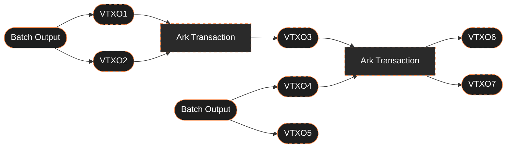
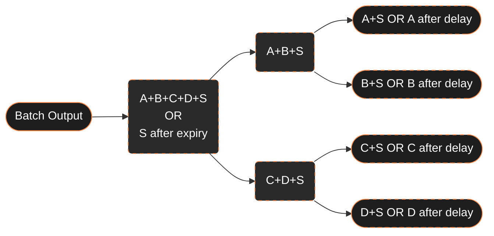
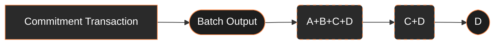

## Introduction

Bitcoin's blockchain offers strong security guarantees at the tradeoff of limited transaction throughput, high fees, and settlement delays, restricting its practical use for various applications requiring greater scalability, lower costs, or faster settlement.

Ark addresses these limitations primarily through a novel batching technique, aggregating numerous individual Bitcoin transactions into a single onchain Bitcoin commitment—called a **Batch Output**. This significantly reduces transaction costs per user and greatly enhances scalability.

The protocol mirrors Bitcoin’s familiar UTXO structure using **Virtual Transaction Outputs (VTXOs)**. These offchain abstractions preserve a familiar output ownership model while embedding many claims into a single Batch Output. VTXOs ensure that users retain unilateral control over their funds and enable efficient offchain coordination before final settlement on Bitcoin.

## Core Features

### Transaction Batching

In Bitcoin, ownership is represented through transaction outputs. Each output typically corresponds to a single owner who controls the associated funds through their private keys.

Ark introduces **Batch Outputs**, which partition a single transaction output (UTXO) into multiple **Virtual Transaction Outputs (VTXOs)**. Each VTXO can be independently spent or claimed by its owner without affecting others.

### Offchain Execution

Ark provides an offchain execution layer designed specifically for rapid and cost-effective coordination among users. VTXO owners transfer value through **Ark Transactions**, which closely mirror Bitcoin transactions—spending existing VTXOs and creating new ones—but are coordinated offchain with greater flexibility and lower overhead.

The Ark Operator coordinates and co-signs these offchain transactions, maintaining orderly processing. This offchain coordination enables high-frequency payments, conditional logic, and complex multi-party transactions that would be impractical directly on Bitcoin.

### The Ark Operator

The protocol operates with a designated Ark Operator who:
* Creates and manages Batch Outputs through onchain Bitcoin transactions
* Facilitates offchain transactions between users
* Provides liquidity for commitment transactions (on‑chain settlements that finalise each batch)
* Co-signs multisignature arrangements while preserving user exit rights

The Operator's role is designed with strict boundaries that ensure users always maintain control over their funds.

## Security Considerations

### Security Model for Batch Outputs

Onchain Batch Outputs use an n-of-n multisignature arrangement involving all VTXO owners and the Ark Operator. During batch creation, participants generate presigned transactions outlining both collaborative and unilateral spend paths:

* Collaborative Spending: Requires signatures from a VTXO owner and the Operator.
* Unilateral Spending: Allows individual users to withdraw independently, without other parties’ cooperation, typically after a predefined delay.

### Unilateral Exit
In order for a user to **unilaterally exit**, they must broadcast a combination of presigned transactions containing their VTXO. Possessing these presigned transactions ensures a user can always spend their allocated funds independently, without requiring coordination with other participants or the operator.

### Transaction Finality

Ark's architecture introduces two distinct levels of transaction confirmation, each with different security properties:

* **Preconfirmations**

    Transactions in the offchain execution layer receive preconfirmations from the Ark Operator. Preconfirmations indicate that the Operator has processed and co-signed the transaction, enabling the VTXO (Virtual Transaction Output) owner to use the resulting outputs for subsequent transactions. This mechanism allows for rapid execution and instant feedback within the offchain environment. 

    However, preconfirmations rely on the Operator's integrity. A malicious Operator could double-sign conflicting transactions, creating competing VTXO ownership chains that undermine a user's unilateral control over their assets. VTXOs in this state exist in a "preconfirmation" status—cryptographically valid but lacking Bitcoin's consensus guarantees until further secured.

* **Bitcoin Finality**

    Transaction finality in Ark is achieved when VTXOs are anchored to the Bitcoin blockchain through **Batch Swaps**, a process that leverages Bitcoin’s consensus mechanism to secure the offchain transaction history. Batch Swaps function like atomic swaps, enabling users to safely transfer their preconfirmed VTXOs to the Operator in exchange for new VTXOs secured by an onchain Bitcoin transaction, known as the Commitment Transaction. 

    Once a Batch Swap confirms onchain, its VTXOs gain Bitcoin-level immutability and irreversibility. Users are encouraged to periodically settle their offchain transactions onchain through Batch Swaps to fully secure their holdings.

### Batch Expiry
To ensure sustainable operation of the protocol, each Batch Output includes an expiry timestamp that applies to all VTXOs derived from it. This timestamp creates a liveness requirement for users as they need to take action during the specified timebound window.

Before batch expiration, VTXO owners can either participate in a new Batch Swap or withdraw their funds onchain. If no action is taken, the Ark Operator gains the unilateral right to reclaim the Batch Output upon expiry, recovering the liquidity they provided during the initial batch creation.

This expiry mechanism creates a balanced system where users maintain full control over their funds while the protocol can efficiently recycle liquidity for new batches. Users should remain mindful of approaching expiry dates to ensure continuous access to their funds. Client software can schedule background jobs to renew before expiry or receive reminder notifications, ensuring funds stay accessible with minimal user intervention.