Arkade virtualizes Bitcoin's transaction layer to support scalable, expressive applications without changing Bitcoin or introducing trust in new consensus systems. At its core, Arkade introduces a **TEE-anchored execution architecture**, where security flows from a bounded trust assumption—one verifiable program running in one verifiable hardware environment.

Arkade is composed of three core layers:

- **Virtual Execution Layer**: Offchain transaction logic and parallel DAG-based processing.
- **Coordination Layer**: Batch construction, ordering, and liquidity handling.
- **Bitcoin Settlement Layer**: Final anchoring and user exit paths to Bitcoin L1.

---

## 🔐 Bonded Accountability via TEE-Backed Ark Signer

Arkade makes a crucial design tradeoff: it embraces centralization of the signing process but wraps it in **verifiable, accountable hardware** to guarantee integrity.

### Why this matters

In both Ark and Arkade, **preconfirmed state has never been trustless**. Users rely on the signer not to double-sign competing transactions. The Arkade Signer runs inside a **Trusted Execution Environment (TEE)**, which:

- **Generates a single signing key** internally and shares only the public key.
- **Cosigns all VTXOs**: each VTXO in the system is partially locked to this signer key.
- **Is verifiably attested**: users can independently confirm the exact binary running in the TEE.

### 💥 Collusion Defense: Bonded Signer with Burn Enforcement

To deter signer collusion with a prior sender (to double-spend a VTXO), Arkade introduces **capital bonding**:

- The Ark Operator locks funds **onchain to the Ark Signer's key**, publicly visible.
- If a user detects a double-sign (two conflicting preconfirmed states), they:
  - Build an unsigned **burn transaction** using the signer’s bonded UTXOs.
  - Send a message to the Ark Signer (via **end-to-end encrypted** channel) including:
    - A proof of misbehavior.
    - The unsigned burn transaction.
- The Ark Signer, by design, verifies the proof and signs the burn transaction.
- **The bond is burned onchain**, permanently slashing the signer.

> This approach flips Arkade's greatest weakness—centralized execution—into a security mechanism. Because we know exactly what the signer will do under which conditions, we can assign **verifiable accountability** with economic consequences.

---

## 🔁 Diagram

```mermaid
flowchart TD
  subgraph Bitcoin_Settlement_Layer["Bitcoin Settlement Layer 🧱"]
    BB[Bitcoin Blockchain 🧱]
    BO[On-Chain Batch Output 🥩]
    BB --> BO
  end

  subgraph Liquidity_Pool["Bitcoin Liquidity Pool 💰"]
    LP1[LP Wallet 💰]
    LP2[LP Wallet 💰]
  end

  subgraph Coordination_Layer["Coordination Layer 🧃"]
    AB[Ark Batcher 🧃]
  end

  subgraph Virtual_Execution_Layer["Virtual Execution Layer 📦"]
    VM[Virtual Mempool 📦]
    TEE1[Ark Signer 🔐]
    UW1[User Wallet 🧑‍💻]
    UW2[User Wallet 🧑‍💻]

    VM --> TEE1
    TEE1 --> UW1
    TEE1 --> UW2
    VM --> UW1
    VM --> UW2
  end

  LP1 --> AB
  LP2 --> AB
  AB --> BO
  TEE1 --> AB
  BO --> BB
  UW1 --> BB
  UW2 --> BB
```

---

## 🧠 Virtual Execution Layer

- **Virtual Mempool**: DAG-based coordination of Arkade Transactions.
- **Arkade Transactions**: Offchain programs backed by fallback Bitcoin scripts.
- **ArkadeScript**: Programmable logic executed across VTXO chains.

---

## 🧃 Coordination Layer

- **Ark Batcher**: Assembles user intents into batches.
- **Liquidity Providers**: Fund batch outputs; participate in expiry and batch swap logic.

---

## 🧱 Bitcoin Settlement Layer

- **Batch Output**: Aggregated VTXOs finalized onchain.
- **Unilateral Exit**: Every user can leave the system independently with their VTXO.

---

## 🔬 Further Research

Arkade is designed to minimize trust assumptions but also to evolve them. One active area of exploration is support for **Self-Hosted TEEs**.

### 🧩 Self-Hosted Ark Signers (coming soon)

While today’s Arkade Signer is run by the operator, the architecture is modular:

- **Users may deploy their own TEE instance** running the same open-source Ark Signer software.
- The existing Ark Signer can handshake, verify, and replicate signing authority to the new enclave.
- This gives users the ability to **bypass the operator** while preserving:
  - Consistent VTXO logic
  - Double-spend resistance
  - Presigned Bitcoin exits

> Long term, this opens a path to **federated or user-hosted Arkade environments**, without requiring protocol forks or validator-based consensus.

Arkade's execution layer begins centralized but not opaque. Through TEEs, capital bonding, and future modularity, users are equipped with tools to extend, fork, and harden the trust surface over time.