# System Architecture

Arkade implements a vertically layered architecture that integrates offchain execution with Bitcoin-native security. The system is composed of three core layers:

- **Virtual Execution Layer** (Virtual Mempool)
- **Coordination Layer**
- **Bitcoin Settlement Layer**

At the heart of the design is the principle of **virtualization without compromise**—preserving user custody, deterministic exits, and settlement on Bitcoin L1, while introducing scalable, expressive computation offchain.

---

## 🔁 Diagram

```mermaid
flowchart TB
  subgraph Bitcoin_Settlement_Layer["Bitcoin Settlement Layer"]
    direction TB
    BB[Bitcoin Blockchain 🧱]
    BO[On-Chain Batch Output 🥩]
    BB --- BO
  end
  
  subgraph Coordination_Layer["Coordination Layer"]
    direction TB
    AB[Ark Batcher 🧃]
  end
  
  subgraph Virtual_Execution_Layer["Virtual Execution Layer"]
    direction TB
    AS1[Ark Signer 🔏]
    TEE1[TEE Enclave 1 🔐]
    AS1 --- TEE1
    
    AS2[Ark Signer 🔏]
    TEE2[TEE Enclave 2 🔐]
    AS2 --- TEE2
    
    AS3[Ark Signer 🔏]
    TEE3[TEE Enclave 3 🔐]
    AS3 --- TEE3
    
    UW[User Wallets 🧑‍💻]
  end
  
  subgraph Liquidity_Pool["Bitcoin Liquidity Pool"]
    direction TB
    LP[LP Wallets 💰]
  end
  
  Bitcoin_Settlement_Layer --- Coordination_Layer --- Virtual_Execution_Layer
```

---

## 🧠 Virtual Execution Layer (Virtual Mempool)

This layer, also known as the Virtual Mempool, is where user transactions are processed in real time. It functions as a DAG-based engine for coordinating transaction flows, replacing Bitcoin's linear mempool and enabling parallel execution across independent chains of VTXOs.

- **TEE Enclaves**: Secure hardware modules that provide a trusted execution environment for transaction processing and verification.
- **Ark Signers**: Built on top of TEE enclaves, these components verify transaction logic, cosign valid transactions, and prevent double-spending. All signer operations are auditable via remote attestation.
- **User Wallets**: Users interact with Arkade via VTXOs and maintain the ability to unilaterally exit to Bitcoin L1 at any time.

## 🧃 Coordination Layer

- **Ark Batcher**: Collects user intents, prioritizes them based on fees, and assembles them into batch commitments. Operates within a TEE to ensure impartiality and transparency.
- **Liquidity Providers (LPs)**: Fund the batches through on-chain wallets. Their capital backs the virtual layer, and they earn fees in return. LPs can be fully external entities.

## 🧱 Bitcoin Settlement Layer

- **Batch Output**: Aggregates the state of many Arkade transactions into a single on-chain UTXO.
- **Settlement Commitments**: Secure the system by anchoring offchain transaction history to Bitcoin’s consensus.

Every Arkade transaction flows through this pipeline—from intent in the Virtual Mempool to finality on Bitcoin—while remaining self-custodial and cryptographically verifiable throughout.

---

## ⚙️ Design Principles

- **Deterministic Exit**: Every VTXO has a unilateral path back to Bitcoin, enforced by presigned scripts.
- **Hardware-Enforced Integrity**: All sensitive operations (signing, batching) are confined to TEEs with remote attestation.
- **Composable and Scalable**: The DAG-based architecture allows Arkade to scale horizontally as user demand grows, without introducing global state bottlenecks.

Arkade virtualizes Bitcoin execution without compromising on security, user sovereignty, or decentralization.